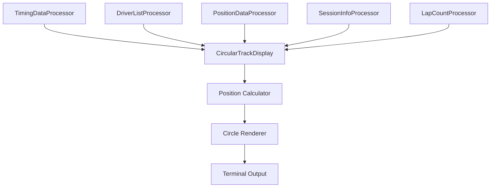

# Design Document

## Overview

The circular track visualization feature will create a new display mode that represents the F1 track as a circle with driver positions shown as dots moving around the circumference. This visualization will integrate with the existing UndercutF1 console application architecture, leveraging the current timing data processing system and display framework.

The feature will provide an intuitive way to visualize driver positions, gaps, and track progression in real-time, complementing the existing timing tower and other display modes. The circular representation abstracts the complex geometry of actual F1 tracks into a simple, easy-to-understand format where lap completion corresponds to full revolutions around the circle.

## Architecture

### Display System Integration

The feature will integrate with the existing display architecture by:

1. **CircularTrackDisplay Class**: A new display class implementing `IDisplay` interface, similar to existing displays like `TimingTowerDisplay` and `CircleOfDoomDisplay`
2. **Screen Enum Extension**: Adding `CircularTrack` to the existing `Screen` enum
3. **Input Handler**: Creating `SwitchToCircularTrackInputHandler` for navigation
4. **State Management**: Utilizing the existing `State` class for cursor management and screen transitions

### Data Flow Architecture



The display will consume data from existing processors without requiring new data sources or modifications to the timing data pipeline.

## Components and Interfaces

### Core Components

#### 1. CircularTrackDisplay
```csharp
public class CircularTrackDisplay : IDisplay
{
    public Screen Screen => Screen.CircularTrack;
    public Task<IRenderable> GetContentAsync();
    public Task PostContentDrawAsync();
}
```

**Responsibilities:**
- Coordinate data from multiple processors
- Calculate driver positions on the circle
- Render the circular visualization
- Handle real-time updates

#### 2. CircularTrackPositionCalculator
```csharp
public class CircularTrackPositionCalculator
{
    public CircularPosition CalculatePosition(TimingDataPoint.Driver driver, int currentLap);
    public double GetTrackProgress(TimingDataPoint.Driver driver);
}
```

**Responsibilities:**
- Convert timing data to circular positions
- Handle sector-based position interpolation
- Manage multi-lap scenarios
- Calculate relative positions between drivers

#### 3. CircularTrackRenderer
```csharp
public class CircularTrackRenderer
{
    public IRenderable RenderCircle(List<DriverPosition> positions, int terminalWidth, int terminalHeight);
    public string GenerateAsciiCircle(List<DriverPosition> positions);
}
```

**Responsibilities:**
- Generate ASCII-based circular visualization
- Handle driver dot positioning and collision avoidance
- Apply team colors and driver identifiers
- Scale visualization to terminal dimensions

#### 4. SwitchToCircularTrackInputHandler
```csharp
public class SwitchToCircularTrackInputHandler : IInputHandler
{
    public ConsoleKey[] Keys => [ConsoleKey.R]; // 'R' for Race track
    public Task ExecuteAsync(ConsoleKeyInfo keyInfo, CancellationToken cancellationToken);
}
```

### Data Models

#### CircularPosition
```csharp
public record CircularPosition
{
    public double Angle { get; init; }        // 0-360 degrees around circle
    public double RadialPosition { get; init; } // Distance from center (for multi-lap)
    public int LapNumber { get; init; }
    public double TrackProgress { get; init; } // 0.0-1.0 completion of current lap
}
```

#### DriverPosition
```csharp
public record DriverPosition
{
    public string DriverNumber { get; init; }
    public string DriverTla { get; init; }
    public string TeamColor { get; init; }
    public CircularPosition Position { get; init; }
    public DriverStatus Status { get; init; }
    public string GapToLeader { get; init; }
}
```

## Data Models

### Position Calculation Logic

The system will calculate driver positions using a multi-layered approach:

1. **Base Position**: Use `TimingDataPoint.Driver.Line` for race position
2. **Intra-lap Progress**: Interpolate position based on sector completion
3. **Circular Mapping**: Convert linear track progress to angular position (0-360°)
4. **Multi-lap Handling**: Use different radial distances for drivers on different laps

### Sector-based Interpolation

```csharp
private double CalculateIntraLapProgress(Dictionary<string, LapSectorTime> sectors)
{
    var sector1Complete = sectors.GetValueOrDefault("0")?.Value != null;
    var sector2Complete = sectors.GetValueOrDefault("1")?.Value != null;
    var sector3Complete = sectors.GetValueOrDefault("2")?.Value != null;
    
    return (sector1Complete, sector2Complete, sector3Complete) switch
    {
        (false, false, false) => 0.05,  // Just started lap
        (true, false, false) => 0.33,   // 1/3 through lap
        (true, true, false) => 0.66,    // 2/3 through lap
        (true, true, true) => 0.95,     // Almost complete
        _ => 0.0
    };
}
```

### Rendering Strategy

The visualization will use ASCII characters to create a circular representation:

1. **Circle Generation**: Mathematical calculation of circle points using terminal character grid
2. **Driver Dots**: Unicode characters (●, ◉, ○) with ANSI color codes
3. **Collision Avoidance**: Offset nearby drivers slightly to prevent overlap
4. **Dynamic Scaling**: Adjust circle size based on terminal dimensions

## Error Handling

### Data Availability
- **No Timing Data**: Display "Waiting for timing data..." message
- **Incomplete Driver Data**: Show available drivers, mark missing data as "N/A"
- **Session Transitions**: Handle session start/end gracefully

### Terminal Compatibility
- **Small Terminals**: Minimum circle size with abbreviated driver identifiers
- **Color Support**: Fallback to monochrome if color not supported
- **Unicode Support**: ASCII fallback for driver markers if Unicode unavailable

### Real-time Updates
- **Stale Data**: Indicate data freshness with timestamps
- **Connection Loss**: Show last known positions with warning indicator
- **Performance**: Limit update frequency to prevent terminal flickering

## Testing Strategy

### Unit Testing
1. **Position Calculator Tests**
   - Verify sector-based interpolation accuracy
   - Test multi-lap position handling
   - Validate angle calculations (0-360°)

2. **Renderer Tests**
   - ASCII circle generation accuracy
   - Driver positioning collision detection
   - Color code application

3. **Data Integration Tests**
   - Mock timing data processing
   - Driver list integration
   - Session state handling

### Integration Testing
1. **Display System Integration**
   - Screen switching functionality
   - Input handler registration
   - State management consistency

2. **Real-time Data Flow**
   - Live timing data processing
   - Update frequency and performance
   - Memory usage during long sessions

### Manual Testing Scenarios
1. **Race Sessions**: Full race with pit stops, retirements, safety cars
2. **Qualifying Sessions**: Multiple drivers on track simultaneously
3. **Practice Sessions**: Drivers entering/leaving track frequently
4. **Edge Cases**: Single driver, all drivers retired, session restart

### Performance Testing
- **Update Frequency**: Target 10-15 FPS for smooth movement
- **Memory Usage**: Monitor for memory leaks during long sessions
- **CPU Usage**: Ensure minimal impact on overall application performance
- **Terminal Rendering**: Test on various terminal sizes and types

The testing strategy ensures the circular track visualization integrates seamlessly with the existing application while providing accurate, real-time representation of driver positions and track progression.