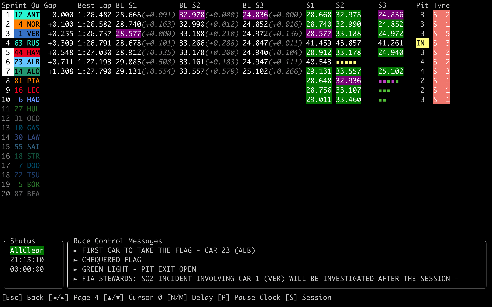
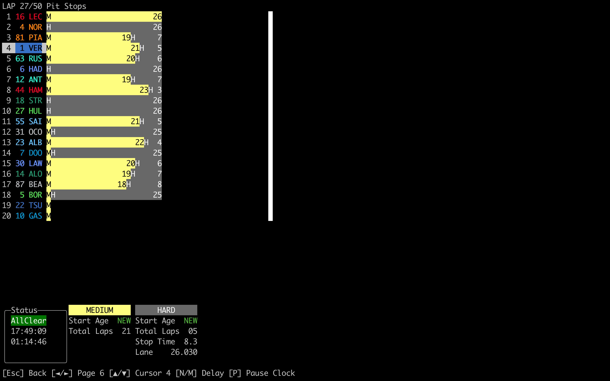

<!-- omit in toc -->
# undercut-f1

undercut-f1 is an open source F1 Live Timing client.

`undercutf1` is a TUI application which uses `UndercutF1.Data` to show a Live Timing screen during sessions, and records the data for future session replays.
F1 live broadcasts are usually delayed by some undeterminable amount (usually 30-60 seconds), so the TUI allows you to delay the data being displayed so that you can match up what you see on your screen to what you see on your TV.

The `UndercutF1.Data` library is provided to facilitate connectivity with the F1 Live Timing data stream, and handle all the processing of the incoming data. It also allows for "simulated" streams, where previously recorded data streams can be played back to allow for easy development/testing.

Feature Highlights:


- [Timing Tower](#timing-tower-during-a-race) showing for each driver:
  - Live sector times, with colouring for personal/overall fastest
  - Last & Best Lap
  - Current tyre
  - Age of current tyre
  - Interval to driver in front
  - Gap to leader
  - Gap [between a selected driver](#using-a-cursor-to-display-relative-gap-for-a-specific-driver) and all other drivers (useful for monitoring pit windows)
- [Pit Stop Strategy](#tyre-stint--strategy) gives you at-a-glance information about all the drivers strategies
- [Race Control](#race-control-page) messages including investigations, penalties, lap deletions, and weather
- [Driver Tracker](#driver-tracker) shows the position of selected drivers on a live track map
- Lap-by-lap [Timing History](#using-a-cursor-to-view-timing-history-by-lap) to observe gaps over time

<!-- omit in toc -->
## Table of Contents

- [Inspiration](#inspiration)
- [UndercutF1 in Action](#undercutf1-in-action)
  - [Timing Tower during a Race](#timing-tower-during-a-race)
  - [Using a Cursor to Display Relative Gap for a Specific Driver](#using-a-cursor-to-display-relative-gap-for-a-specific-driver)
  - [Timing Tower during Practice/Qualifying](#timing-tower-during-practicequalifying)
  - [Race Control Page](#race-control-page)
  - [Driver Tracker](#driver-tracker)
  - [Tyre Stint / Strategy](#tyre-stint--strategy)
  - [Using a Cursor to View Timing History by Lap](#using-a-cursor-to-view-timing-history-by-lap)
  - [Listen to and Transcribe Team Radio](#listen-to-and-transcribe-team-radio)
- [Getting Started with `undercutf1`](#getting-started-with-undercutf1)
  - [Installation](#installation)
    - [Prerequisites](#prerequisites)
    - [Install and run as a dotnet tool](#install-and-run-as-a-dotnet-tool)
    - [Install and run the standalone executable](#install-and-run-the-standalone-executable)
    - [Run using the docker image](#run-using-the-docker-image)
      - [Known Issues with Docker](#known-issues-with-docker)
    - [Run directly from Source](#run-directly-from-source)
  - [Start Timing for a Live Session](#start-timing-for-a-live-session)
  - [Start Timing for a Pre-recorded Session](#start-timing-for-a-pre-recorded-session)
  - [Download a previous session data for replay](#download-a-previous-session-data-for-replay)
  - [During the Session](#during-the-session)
    - [Managing Delay](#managing-delay)
    - [Using the Cursor](#using-the-cursor)
- [Configuration](#configuration)
  - [Default Directories](#default-directories)
- [Logging](#logging)
- [Live Timing Data Source](#live-timing-data-source)
- [Data Recording and Replay](#data-recording-and-replay)
- [Notice](#notice)

## Inspiration

This project is heavily inspired by the [FastF1 project by theOehrly](https://github.com/theOehrly/Fast-F1). They did a lot of the work understanding the SignalR stream coming from the F1 Live Timing service. Visit their project if you'd like to do any sort of data analysis on past F1 events, or gather live timing data using their module.

## UndercutF1 in Action

### Timing Tower during a Race

Monitor sector times and gaps, see recent race control messages, capture position changes, observe pit strategies, and more with the standard Timing Tower view.


### Using a Cursor to Display Relative Gap for a Specific Driver

Use the cursor controlled by the <kbd>▼</kbd>/<kbd>▲</kbd> `Cursor` actions in the <kbd>O</kbd> `Timing Tower` screen to select a specific driver (in this case Norris) to see the relative interval between that driver and all other. This is useful for determining where a driver will fall to after a pit stop, or looking at pit windows during under cuts.

Additionally, the gap between the selected drivers and those around them over the last four laps will be displayed at the bottom of the screen. This allows you to easily see evolving gaps over time and evaluate how soon a driver may catch up or pull away.


### Timing Tower during Practice/Qualifying

Monitor live/best sector times, gaps, tyres, and lap deletions easily with the specialized timing tower for non-race sessions.



### Race Control Page

The `Race Control` page shows all Race Control Messages for the session, along with other session data such as the Weather.


### Driver Tracker

The `Driver Tracker` page shows a track map overlayed with selected drivers. Use the <kbd>▼</kbd>/<kbd>▲</kbd> `Cursor` actions to choose drivers, then use the <kbd>⏎</kbd> `Toggle Select` action to toggle the inclusion of the driver on the track map. The driver under the current cursor position will also be highlighted on the map, and timing gaps will switch to interval between that driver and all other drivers.


NOTE: Currently the track map is only supported in the iTerm2 terminal (by implementing the [iTerm2's Inline Image Protocol](https://iterm2.com/documentation-images.html)), and terminals which implement the [Kitty Graphics Protocol](https://sw.kovidgoyal.net/kitty/graphics-protocol/). Other protocols (such as Sixel) may be supported in the future. If the track map doesn't work in your terminal, please raise an issue and I will try and fix/implement support.

### Tyre Stint / Strategy

The `Tyre Stint` page shows the tyre strategy for all the drivers. At a glance, see what tyres the drivers have used, how old they are, and if they are on an offset strategy to any other drivers.

Use the <kbd>▼</kbd>/<kbd>▲</kbd> `Cursor` actions to view more information for a particular drivers strategy.



### Using a Cursor to View Timing History by Lap

In the `Timing by Lap` page, you can use the cursor controlled by the <kbd>▼</kbd>/<kbd>▲</kbd> `Cursor` actions to view historical snapshots of the timing tower at the end of every lap. This view will show position changes during that lap, and relative changes in Gap and Interval. Scrolling through laps allows you to build a picture of how the race is unfolding.

Charts on the right display how Gap to Leader and Lap Time for all selected drivers over the last 15 laps, letting you see trends and catch strategies unfolding.


### Listen to and Transcribe Team Radio

Listen to team radio clips from anytime in the session, and use a local ML model (Whisper) to transcribe the audio on demand. Transcription accuracy is fairly low, depending on the that days audio quality and driver. Suggestions welcome for improving this!

Audio playback prerequisites:

- If on Linux, make sure you have `aplay` and `mpg123` installed. See [the NetCoreAudio Prerequisites for more details](https://github.com/mobiletechtracker/NetCoreAudio?tab=readme-ov-file#prerequisites)


## Getting Started with `undercutf1`

### Installation

#### Prerequisites

UndercutF1 tries to statically link as many dependencies as possible to make installation and usage easy.
There are however some utilities that may need to be installed for some functionality:

- Team Radio audio playback uses [NetCoreAudio](https://github.com/mobiletechtracker/NetCoreAudio) for playback. See their [Prerequisites](https://github.com/mobiletechtracker/NetCoreAudio#prerequisites) for information if playback does not work.
  - On Linux, you need `mpg123` available on the `PATH`. For apt-based systems, you can install with `apt install mpg123`
  - Windows and Mac _should_ work out of the box
- Team Radio transcription relies on FFmpeg and Whisper. Whisper models are downloaded on demand (after user confirmation) in the app. See the [FFmpeg download page](See https://www.ffmpeg.org/download.html) for details on how to instal.
  - On Linux apt-based systems, you can install with `apt install ffmpeg`
  - On Mac with brew, you can install with `brew install ffmpeg`
  - On Windows with WinGet, you can install with `winget ffmpeg`
- Terminal graphics rely on [SkiaSharp](https://github.com/mono/SkiaSharp). I've statically linked all the skia libs, so you shouldn't need to download skia. However, skia does rely on `libfontconfig` which may not be installed on your system by default.
  - On Linux apt-based systems, you can install with `apt install libfontconfig`
  - On Mac with brew, you can install with `brew install fontconfig`

#### Install and run as a dotnet tool

`undercutf1` is available as a `dotnet` tool from NuGet, which means it can be installed system-wide simply by running:

```sh
# Install globally using the -g flag
dotnet tool install -g undercutf1

# Assuming the dotnet tools directory is on your path, simply execute undercutf1
undercutf1
```

This method is recommended as it is easy to keep the app updated using `dotnet tool update -g undercutf1`. You'll need the .NET 9 SDK installed to use this installation method. If you'd rather not install the SDK, try the [standalone installation option below](#install-and-run-the-standalone-executable).

#### Install and run the standalone executable

Standalone executables are attached to each GitHub release. Download the executable for your system OS/architecture and simply run it directly. The list of artifacts are available on the [release page for the latest release](https://github.com/JustAman62/undercut-f1/releases/latest).

```sh
# Download the latest executable (in this case for osx-arm64)
curl https://github.com/JustAman62/undercut-f1/releases/latest/download/undercutf1-osx-arm64 -o ./undercutf1 -L

# Execute undercutf1 to start the TUI
./undercutf1
```

#### Run using the docker image

Docker images are pushed to Dockerhub containing the executable.
The image expects a volume to be mounted at `/data` to store/read session recordings.
If this is not provided, the application will only work for live sessions and you'll lose recorded data.

If provided, the directory you are mapping must already exist, as the docker image will not have the required permissions to create it for you.

If you are using Wezterm or iTerm as your terminal, you'll need to pass through the TERM_PROGRAM environment variable
to make sure that your terminal graphics work correctly (e.g. driver tracker).

```sh
docker run -it -e TERM_PROGRAM -v $HOME/undercut-f1/data:/data justaman62/undercutf1

# Arguments can still be passed to the executable as normal
# for example:
docker run -it -v $HOME/undercut-f1/data:/data justaman62/undercutf1 import 2025
```

##### Known Issues with Docker

- Audio playback of Team Radio may not work when using Docker. This is due to difficulties in using audio devices in a cross-platform way, which I haven't managed to figure out yet.

#### Run directly from Source

```sh
# Checkout the git repository
git clone git@github.com:JustAman62/undercut-f1.git
cd undercut-f1

# Run the console project with `dotnet run`
dotnet run --project UndercutF1.Console/UndercutF1.Console.csproj

# Arguments can be provided after the -- argument, for example
dotnet run --project UndercutF1.Console/UndercutF1.Console.csproj -- import 2025
```

### Start Timing for a Live Session

1. Start `undercutf1` as described above
2. Navigate to the <kbd>S</kbd> `Session` Screen
3. Start a Live Session with the <kbd>L</kbd> `Start Live Session` action

During the session, streamed timing data will be written to [the configured data directory](#default-directories). This will allow for [future replays](#start-timing-for-a-pre-recorded-session) of this recorded data.

### Start Timing for a Pre-recorded Session

Data for pre-recorded sessions should be stored in the `<data-directory>/<session-name>` directory. Sample data can be found in this repos [Sample Data](/Sample%20Data/) folder. To use this sample data, copy one of the folders to [the configured data directory](#default-directories) and then it will be visible in step 4 below.

1. OPTIONAL: Download sample data to [the configured data directory](#default-directories). If you already have data, or have checked out the repository, skip to the next step.

    ```sh
    # Import data from the 2025 race in Suzuka
    undercutf1 import 2025 --meeting-key 1256 --session-key 10006
    ```

2. Start `undercutf1` as described [above](#installation)
3. Navigate to the <kbd>S</kbd> `Session` Screen
4. Start a Simulated Session with the <kbd>F</kbd> `Start Simulation` action.
5. Select the session to start using the Up/Down arrows, then pressing <kbd>Enter</kbd>
6. Skip forward in time a bit by decreasing the delay with <kbd>N</kbd> (or <kbd>⇧ Shift</kbd> + <kbd>N</kbd> to decrease by 30 seconds).

### Download a previous session data for replay

F1 provides static timing data files for already completed sessions. This data can be downloaded and converted into the same format `undercutf1` uses to save live recorded data. You can then replay the old session using the steps above.

1. List the meetings that have data available to import with `undercutf1 import <year>`
2. Review the list of meetings returned from the command, and list the available sessions inside the chosen meeting with `undercutf1 import <year> --meeting-key <meeting-key>`
3. Review the list of sessions, and select one to import: `undercutf1 import <year> --meeting-key <meeting-key> --session-key <session-key>`
4. Data that is imported will be saved to the configured data directory. See [Configuration](#configuration) for information on how to change this.

### During the Session

#### Managing Delay

All session data, whether live or pre-recorded, is sent to a `Channel` that acts as a delayed-queue. After your currently configured delay delay, data points are pulled from the queue and processed, leading to updates on the timing screens. The amount of this delay can be changed with the <kbd>M</kbd>/<kbd>N</kbd> `Delay` actions whilst on the timing screens. Hold <kbd>⇧ Shift</kbd> to change the delay by 30 seconds instead of 5. Use the <kbd>,</kbd>/<kbd>.</kbd> keys to change by 1 second. When using `undercutf1` during a live session, you may wish to increase this delay to around ~50 seconds (actual number may vary) to match with the broadcast delay and avoid being spoiled about upcoming action.

Simulated sessions start with a calculated delay equal to the amount of time between the start of the actual session and now. This means you can decrease the delay with the <kbd>N</kbd> `Delay` action to fast-forward through the session.

Data processing, and therefore the "session clock" can be paused using the <kbd>P</kbd> `Pause Clock` action. This allows you to easily synchronize prerecorded sessions by pausing the session in UndercutF1, then resuming at the perfect time when, for example, the formation lap starts.

#### Using the Cursor

There is a global cursor that is controlled with the <kbd>▼</kbd>/<kbd>▲</kbd> `Cursor` actions. What this cursor does depends on the screen, for example is can be used in the Timing Tower screen to scroll through Race Control Messages, or to select a driver on the Tower to see comparative intervals. Hold the <kbd>⇧ Shift</kbd> key to move the cursor by five positions instead of one.

## Configuration

UndercutF1 can be configured using either a simple `config.json` file, through the command line at startup, or using environment variables. JSON configuration will be loaded from [the appropriate config file path](#default-directories), if it exists.

To view what configuration is currently being used, open the <kbd>I</kbd> `Info` screen when the app starts up.

| JSON Path       | Command Line       | Environment Variable       | Description                                                                                                                                                               |
| --------------- | ------------------ | -------------------------- | ------------------------------------------------------------------------------------------------------------------------------------------------------------------------- |
| `dataDirectory` | `--data-directory` | `UNDERCUTF1_DATADIRECTORY` | The directory to which JSON timing data is read or written from. This directory is also where Whisper models will be stored (if downloaded) for team radio transcription. |
| `logDirectory`  | `--log-directory`  | `UNDERCUTF1_LOGDIRECTORY`  | The directory to which logs are written to.                                                                                                                               |
| `verbose`       | `-v\|--verbose`    | `UNDERCUTF1_VERBOSE`       | Whether verbose logging should be enabled. Default: `false`. Values: `true` or `false`.                                                                                   |
| `apiEnabled`    | `--with-api`       | `UNDERCUTF1_APIENABLED`    | Whether the app should expose an API at <http://localhost:61937>. Default: `false`. Values: `true` or `false`.                                                            |
| `notify`        | `--notify`         | `UNDERCUTF1_NOTIFY`        | Whether the app should sent audible BELs to your terminal when new race control messages are received. Default: `true`. Values: `true` or `false`.                        |

### Default Directories

UndercutF1 tries to adhere the Windows and XDG standards as much as possible. By default, timing data and logs are written/read at the following directories:

| Type        | Windows                                | Linux/Mac                                  | Linux/Mac Fallback                  |
| ----------- | -------------------------------------- | ------------------------------------------ | ----------------------------------- |
| Config File | `$env:APPDATA/undercut-f1/config.json` | `$XDG_CONFIG_HOME/undercut-f1/config.json` | `~/.config/undercut-f1/config.json` |
| Data        | `$env:LOCALAPPDATA/undercut-f1/data`   | `$XDG_DATA_HOME/undercut-f1/data`          | `~/.local/share/undercut-f1/data`   |
| Logs        | `$env:LOCALAPPDATA/undercut-f1/logs`   | `$XDG_STATE_HOME/undercut-f1/logs`         | `~/.local/state/undercut-f1/logs`   |

Data and Logs paths can be configured as [described above](#configuration). 
The config file location cannot be modified, and will always be read from the above location.

## Logging

`UndercutF1.Data` writes logs using the standard `ILogger` implementation. SignalR client logs are also passed to the standard `ILoggerProvider`.

When running `undercutf1` logs are available in two places:

- Logs are stored in memory and viewable the <kbd>L</kbd> `Logs` screen. Logs can be scrolled on this screen, and the minimum level of logs shown can be changed with the <kbd>M</kbd> `Minimum Log Level` action.
- Log files are written to the [configured log directory](#default-directories).

Default log level is set to `Information`. More verbose logging can be enabled with the [`verbose` config option](#configuration).

## Live Timing Data Source

F1 live timing is streamed using `SignalR`. The `UndercutF1.Data` simply connects to this endpoint, subscribes to the data feed, and listens for messages. It subscribes to the following "topics":

- `Heartbeat`
- `ExtrapolatedClock`
- `TopThree`
- `TimingStats`
- `TimingAppData`
- `WeatherData`
- `TrackStatus`
- `DriverList`
- `RaceControlMessages`
- `SessionInfo`
- `SessionData`
- `LapCount`
- `TimingData`
- `CarData.z`
- `Position.z`
- `ChampionshipPrediction`
- `TeamRadio`
- `TyreStintSeries`

## Data Recording and Replay

All events received by the live timing client will be written to the configured `Data Directory`, see [see Configuration for details](#configuration). Files will be written to a subdirectory named using the current sessions name, e.g. `<data-directory>/Jeddah_Race/`. In this directory, two files will be written:

- `subscribe.txt` contains the data received at subscription time (i.e. when the live timing client connected to the stream)
- `live.txt` contains an append-log of every message received in the stream

Both of these files are required for future simulations/replays. The `IJsonTimingClient` supports loading these files and processing them in the same way live data would be. Data points will be replayed in real time, using an adjustable delay.

## Notice

undercut-f1 is unofficial and are not associated in any way with the Formula 1 companies. F1, FORMULA ONE, FORMULA 1, FIA FORMULA ONE WORLD CHAMPIONSHIP, GRAND PRIX and related marks are trade marks of Formula One Licensing B.V.
